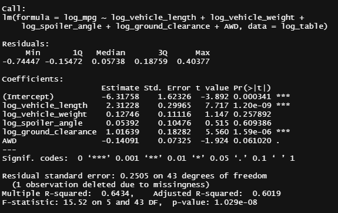
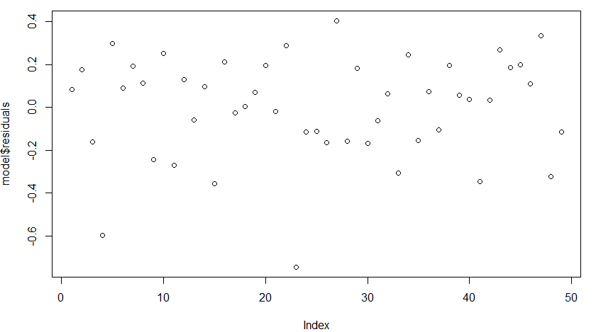
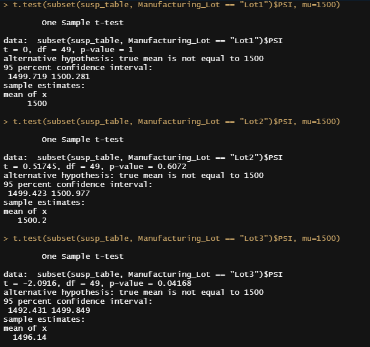

# **MechaCar_Statistical_Analysis**

## **Linear Regression to predict mpg**

### The Data
Our data consists of a cross section of data that is materially complete.  Data includes 6 variables describing 50 obervations of miles-per-gallon, a vehicle's weight, a vehicle's length, its spoiler angle, its clearance from the ground, and a binary variable inidcating if the vehicle is all-wheel drive or not.  Since the population contains 50 variables, it was decided that it would be sufficient for analysis but that sampling might produce too few observations to conclude meaningful statistical inference.  Shapiro tests indicate that all variables wiht the exception of vehicle length can be considered normally distributed. In order state the estimators so that we are able to intepret them in terms of the % effect of each individual variable on the dependent variable, the data (with the exception of AWD) were treated with a lognormal transformation. 

### the Regression

Length, weight, spoiler angle, ground clearance, and AWD, were regressed on MPG.
Findings: 
 - Vehicle length and ground clerance had a statistically significant effect on mpg at the 99% confidence level. 
 - no other estimators were significants determinants of mpg, while given the other independent variables. 
 - The model as a whole has a statistically significant effect on mpg as indicated by the F-Statistic. 
 - The model explains approximately 70% of the variance in mpg. Although it explains most of the variance in Y, other data points and variables should be evaluated to increase the explanatory power of the overall model.
  
**Residuals**

 
 
 - the plot of the residuals indicates random dispersion and no visually obervable presence of bias. 
 - The Breusch-Pagan test for heteroskedasticity was also ran concluding that the data within the model can be considered homoskedastistic in the current context. 

## **Summary Stats on Suspension Coils**

 
 
 
 
 As a group, when considering manufacturing tolerance for 100 lbs per square inch:
 - all 150 observations combined have an average variance of 7.89 pounds per square inch and are within acceptable limits
 - each of the 3 manufacturing lots have standard deviations of 0.98 PSI, 2.73 PSI, and 13.04 PSI, respectively and are within tolerances. 
 - _(variance is the squared differences from the mean while standard dev states variance in the same units as the underlying data)_

## **T-Tests on Each Manufacturing Lot**

The tests for lots 1 and 2 indicate that we can consider the mean of lots 1 and 2 not statistically different from the population mean.  However, we are unable to conclude that the mean for lot 3 is not statistically different than the population mean.  Lot 3 alos had the highest degree of variance among the 3 manufacturing lots. 

## **Study Design - MechaCar vs Competition**

In the instance that MechaCar would like to differentiate itself on the basis of longevity relative to cost as they relate to value, the following could be performed:
- Data would need to be collected for a ground of manufacturers on total lifetime mileage and the initial cost of the car. 
 - Total cost would then be divided by the number of lifetime miles to generate cost per mile.
- Our hypothesis would be to test whether the cost per mile of MechaCar would be statiscally different than the total population of manufacturers
 -  Our null hypothesis in this instance would be that the average cost per mile for MechaCar is not different than the population of manufacturers
-  We would then use a t-test comparing the mean of the cost per mile of MechaCar vs the population. 
 - If we are able to reject the null hypothesis that it is not different, then we can conclude that the cost per mile of MechaCar is different than that of the          population.  We then would check to ensure that the mean of the MechaCar population is lower than that of the population.  

